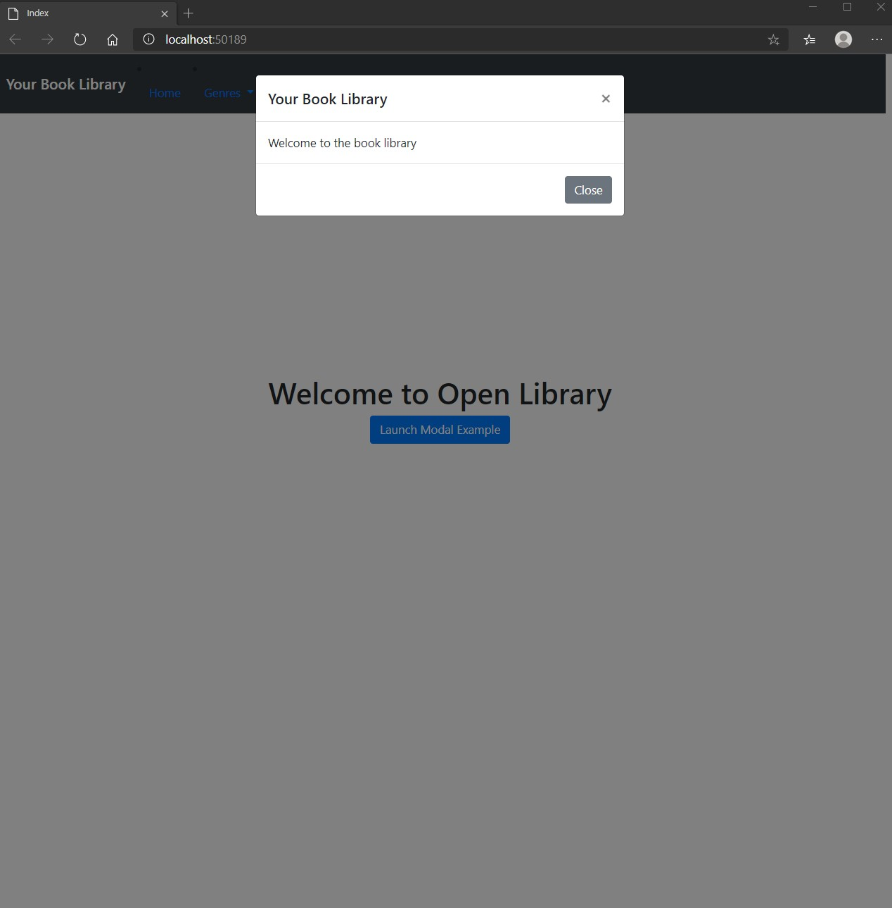
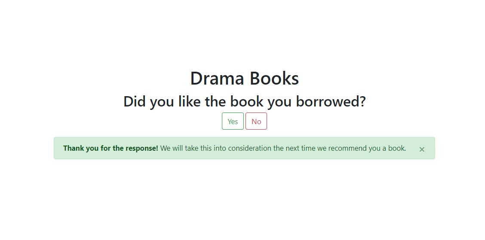

# Tareas del MOC

## Module 9: Client-Side Development

# Lesson 1: Applying Styles

### Demonstration: How to Work with Bootstrap 

- Instalamos los paquetes con npm install
- añadimos la razor layout  **_Layout.cshtml**
- incluimos el codigo Bootdstrap
- añadimos una vista parcial **Index.cshtml** a la accion index del **LibraryController**
- Incluimos el codigo Bootdstrap

